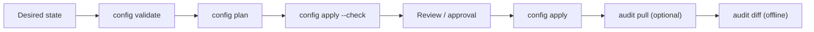

# octostate

[](https://github.com/orang-gaboets/octostate/actions/workflows/ci.yml)
[](https://github.com/orang-gaboets/octostate/releases)
[](https://github.com/orang-gaboets/octostate/blob/main/go.mod)
[](LICENSE)

> **GitOps for GitHub organizations.**
>
> Manage desired state in Git, preview changes, approve safely, and audit drift.

`octostate` is the GitHub organization operations CLI and GitOps engine that
validates desired state, previews reconciliation, preflights supported changes,
applies approved updates, and detects drift.

This repository is the engine: a CLI and reusable building blocks for
automation.
A separate admin or control repository should own organization-specific
approval workflow, branching policy, notifications, and automation around the
engine.

## Why Octostate?

- **Reviewable state** — version-controlled organization changes can be
  reviewed like code
- **Deterministic plans** — repeatable reconciliation previews for automation
- **Safe preflight** — read-only checks before supported mutations
- **Drift visibility** — snapshot-based detection and offline diffing
- **CI-friendly output** — JSON-first results for CI and control-repository
  workflows

## GitOps at a glance



A minimal desired-state file looks like this:

```yaml
organization: example-org
members:
  - username: alice
    role: member
```

The values are fictional; replace them before running commands that contact
GitHub.

The complete newcomer walkthrough, including a fuller example, is in
[Getting started](docs/getting-started.md).

## Install

Go 1.25.0 or newer is required. The module declares its language version in
`go.mod` and may select the patched toolchain automatically when toolchain
switching is enabled.

For a local installation:

```bash
go install github.com/orang-gaboets/octostate/cmd/octostate@latest
```

Automation and control repositories should use an explicitly selected release
instead of `@latest` so their behavior is reproducible.

## Authentication

Commands that contact GitHub require exactly one authentication method:

- `OCTOSTATE_GITHUB_TOKEN` (preferred for PAT authentication)
- `--token` (supported for compatibility; the value can be visible through process inspection)
- `--app-id`, `--installation-id`, and `--app-key-path`

Set `OCTOSTATE_GITHUB_TOKEN` in the environment for a PAT without placing it in
the Octostate process arguments. Do not put tokens, private keys, or
installation secrets in configuration files or documentation.

`config validate` and `audit diff` are offline once their required files exist.
The other GitOps commands read live GitHub state, and `config apply` can mutate
supported resources.

## Try it safely

Create `config/organization.yaml`, then run the read-only path. The first three
commands do not mutate GitHub:

```bash
# Validate desired state without contacting GitHub
octostate config validate --config-dir ./config

# Prefer the environment-backed token source for live commands
export OCTOSTATE_GITHUB_TOKEN="<token>"

# Preview the live reconciliation plan
octostate config plan --config-dir ./config

# Run best-effort, non-mutating apply preflight
octostate config apply --config-dir ./config --check
```

Use a short-lived, least-privilege credential and avoid shared systems. The
legacy `--token` flag remains supported, but may expose the token through
process inspection.

Review the plan and preflight result before intentionally applying supported
create/update actions:

```bash
octostate config apply --config-dir ./config
```

> [!WARNING]
> `config apply --check` is best-effort, non-mutating preflight. It is not a
> transactional GitHub dry run and cannot guarantee that a later apply will
> succeed. Unsupported destructive drift, such as `delete` and `remove`, is
> reported rather than silently executed.

For the complete first-time workflow, including snapshots and offline drift
checks, see [Getting started](docs/getting-started.md).

## Engine and control-repository boundary

This repository documents the engine contract:

- desired state in `config/organization.yaml`;
- live planning and supported apply behavior;
- actual-state snapshots and offline diffing; and
- deterministic command output.

The control repository should own approval policy, branch strategy,
notifications, and workflow orchestration around `config validate`,
`config plan`, `config apply`, `audit pull`, and `audit diff`.

## Documentation

Start with the [documentation index](docs/README.md) or the
[getting-started guide](docs/getting-started.md).

### CLI reference

- [Config commands](docs/cli/config.md)
- [Audit commands](docs/cli/audit.md)
- [Primitive commands](docs/cli/primitives.md)

### GitOps

- [Config schema](docs/gitops/config-schema.md)
- [GitOps overview](docs/gitops/overview.md)
- [GitOps architecture](docs/gitops/architecture.md)
- [Control-repository integration](docs/gitops/control-repo-integration.md)

### Maintainers

- [Development](docs/maintainers/development.md)
- [Code scanning and Code Quality](docs/maintainers/code-scanning.md)
- [Contributor showcase](docs/maintainers/contributors.md)
- [Releases](docs/maintainers/releases.md)
- [Release readiness](docs/maintainers/release-readiness.md)

### Contributing

- [Contribution guide](CONTRIBUTING.md)

### Security

- [Security policy](SECURITY.md)

## Contributors

Thanks to everyone who has contributed to Octostate.

<!-- contributors:start -->
<p>
  <a href="https://github.com/FerdiHS" title="FerdiHS"></a>
  <a href="https://github.com/hansenidden18" title="hansenidden18"></a>
</p>
<!-- contributors:end -->

This list is generated - see the
[contributor showcase guide](docs/maintainers/contributors.md) for how it is
maintained.

## License

This project is licensed under the MIT License. See [LICENSE](LICENSE) for
details.
