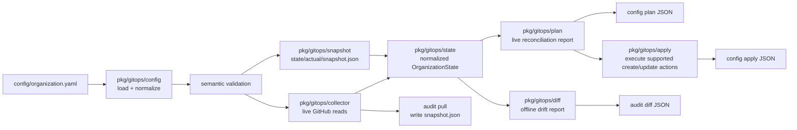

# GitOps Architecture

This page is the code-facing companion to the higher-level
[GitOps overview](./overview.md).

Use it when you want to understand how the shipped GitOps packages fit
together, which package owns which responsibility, and how the main CLI
commands move data through the engine.

## System Flow

## Package Ownership

### `pkg/gitops/config`
- Loads `organization.yaml`
- Uses strict YAML decoding
- Applies safe load-time normalization
- Leaves semantic validation as a separate step

### `pkg/gitops/state`
- Defines the normalized in-memory model of actual GitHub organization state
- Keeps slices non-nil where needed
- Sorts collections deterministically

### `pkg/gitops/collector`
- Reads live GitHub state into `state.OrganizationState`
- Uses bounded concurrency for read-only calls
- Assembles final state sequentially, then normalizes once

Current collector concurrency limits:
- top-level fan-out: `4`
- organization member role reads: `2`
- invitation team lookups: `8`
- per-team member / maintainer / repo-permission reads: `8`

### `pkg/gitops/plan`
- Compares desired config with live `OrganizationState`
- Produces the structured reconciliation report used by `config plan`
  and `config apply`
- Builds independent action phases concurrently, then appends them back in
  fixed order before final normalization

### `pkg/gitops/apply`
- Executes the supported executable subset of the plan
- Keeps writes ordered and controlled
- Reports unsupported `delete` / `remove` drift as skipped state

### `pkg/gitops/snapshot`
- Owns the JSON snapshot file contract
- Persists normalized actual-state snapshots for offline workflows

### `pkg/gitops/diff`
- Compares desired config with the stored snapshot offline
- Produces drift reports without live GitHub calls
- Reuses the same action vocabulary and deterministic ordering model as plan

### `pkg/gitops/syncfromlive`
- Builds desired-state proposals from live GitHub state
- Powers bootstrap, adopt, and materialize flows

## Command Workflows

### `repo-builder config plan`
1. Load and normalize `organization.yaml`
2. Validate desired state semantically
3. Collect live GitHub state through `collector`
4. Build the reconciliation report through `plan`
5. Normalize the final report and print JSON

### `repo-builder config apply`
1. Load and validate desired state
2. Collect live GitHub state
3. Build the reconciliation report
4. Execute supported `create` / `update` actions through `apply`
5. Print executed and skipped actions as JSON

### `repo-builder audit pull`
1. Load desired state to determine the target organization
2. Collect live GitHub state
3. Normalize and persist `state/actual/snapshot.json`
4. Print the snapshot write result

### `repo-builder audit diff`
1. Load desired state
2. Load the stored snapshot
3. Compare desired vs stored actual state through `diff`
4. Print a deterministic offline drift report

## Determinism Rules

The GitOps engine relies on a few consistent rules to keep CI output and review
artifacts stable:
- normalize desired config after loading
- normalize actual state after collection
- normalize snapshots before writing
- normalize plan and diff outputs before printing
- append concurrent phase results back in a fixed order

Those rules are what make repeated runs produce stable JSON, even when live
reads or pure build phases use bounded concurrency internally.

## Control-Repo Boundary

This page is intentionally about the engine internals only. The control repo
should own:
- approval workflow
- issue intake
- branch policy
- notifications
- when these commands are run in CI or automation

For that engine-facing boundary, see
[Control-repo integration](./control-repo-integration.md).
